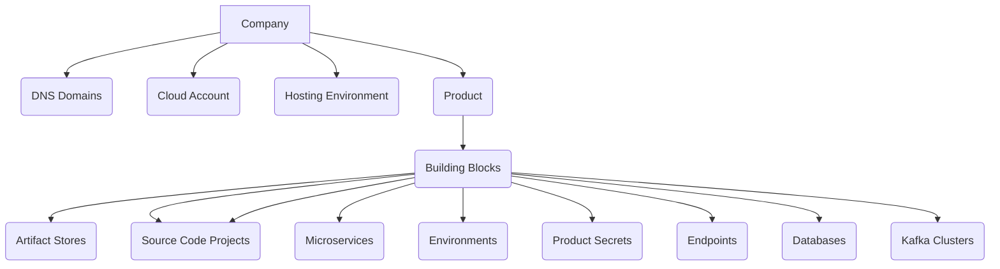

# Planton Cloud Resource Hierarchy

[//]: # (https://mermaid.live/edit#pako:eNqFkkFuwjAQRa9ieeVKcIEsKkFCC6VUldJVmy6m9gRcYk80sZEQ4u41kWgXKI1XtufN9__WnKQmgzKTW4Z2J96Kyou0Zh85uRb88VNMp_diroqXUhTkwPru7gbpmVzlDUUjZlpT9GGAKtSSumD9Viz8wTJ5h4PsQr0ymaiv9b9zX35X82gbc9GaN6T3V2O39z3-oGYcbA06iDIQ4__0oyopskaRp-8R6d1v_PUx0LJUG6uZOuSD1SPyK3UbfwB9uqYWJWrGMBJznZRNS3ZM9lkVEOALuhGnG7WGeg8ib2IXkBMsJ9Ihp1EwaWxOl-ZKhh06rGSWtgZ4X8nKnxMHMVB59FpmgSNOZGwNBCwspGlzMquh6fD8A-AhylE)

## Company

At the top level, there is a company, which can have multiple resources associated with it. The company has several
sub-resources that include DNS domains, cloud accounts, hosting environments, and products.

[//]: # (Checkout [Company]&#40;/company&#41; page to learn more.)

### DNS Domains

DNS domains are used to manage and control the DNS records associated with a company's web applications.
This includes the ability to create, edit, and delete DNS records, as well as managing DNS settings such as name servers
and TTL values.

Checkout [DNS Domains](/dns-domains) page to learn more.

### Cloud Accounts

A cloud account is a subscription to a cloud provider, such as AWS or Azure. It allows developers to
access and utilize cloud-based resources, such as virtual machines, storage, and networking services, for their software
applications.

Checkout [Cloud Accounts](/cloud-accounts) page to learn more.

### Hosting Environments

A hosting environment is a batteries included kubernetes cluster created in one of the cloud-account of your company.
Hosting Environments are where all the building blocks of your company's products are hosted and run.

Checkout [Hosting Environment](/hosting-environments) page to learn more.

### Products

A product is a software application or service that is developed and maintained by your company. It includes all
the necessary resources, such as source code, artifacts, and environments, to build, test, and deploy the software.

[//]: # (Checkout [Products]&#40;/products&#41; page to learn more.)

### Product Building Blocks

The products contain building blocks that are used to develop and deploy the software. These building blocks can include
artifact stores, source code projects, microservices, environments, product secrets, endpoints, databases, and Kafka
clusters.

The building blocks are the basic components of the product and are essential for developing and deploying software
applications.

#### Artifact Stores

An artifact store is a repository that stores and manages software artifacts, such as binary files, code
libraries, and documentation. It allows developers to easily store and share their artifacts with other team members,
while also enabling them to manage and track changes to the artifacts.

#### Source Code Servers

A source code server is a central location where the source code for a company's software applications is stored and
managed. It provides developers with a single location to access, modify, and share their source code, while also
providing version control and collaboration tools to manage changes to the code.

Checkout [Source Code Servers](/source-code-servers) page to learn more.

#### Source Code Projects

Each source code project is a collection of source code files that make up a software application. It
allows developers to write, test, and debug their code in a structured manner, while also providing them with version
control and collaboration tools.

Checkout [Source Code Projects](/source-code-projects) page to learn more.

#### Microservice

A microservice is a small, independent service that performs a specific task within a larger application.
It is designed to be modular and loosely coupled, allowing developers to make changes to the microservice without
impacting the rest of the application. Microservices are often used in cloud-based environments to create scalable and
fault-tolerant applications.

Checkout [Source Code Projects](/source-code-projects) page to learn more.

#### Environment

An environment is a virtual space where software applications are deployed for testing and production
purposes. It provides developers with a controlled environment to test and validate their code, while also allowing them
to simulate real-world scenarios.

#### Product Secrets

Product secrets are confidential data that are used to authenticate and authorize access to software
applications. They include credentials, such as passwords and API keys, and are stored securely to prevent unauthorized
access.

#### Endpoint

An endpoint is the URL that users can use to access a software application. It provides a gateway for users to
interact with the application, and can be customized to provide a user-friendly experience.

#### Database

A database is a structured collection of data that is stored and managed by a software application. It
provides developers with a scalable and reliable way to store and manage data, and can be customized to meet the
specific needs of the application.

#### Kafka Cluster

A Kafka cluster is a distributed messaging system that is used to handle real-time data streaming between
microservices. It provides developers with a scalable and fault-tolerant way to process and analyze large amounts of
data in real-time.
